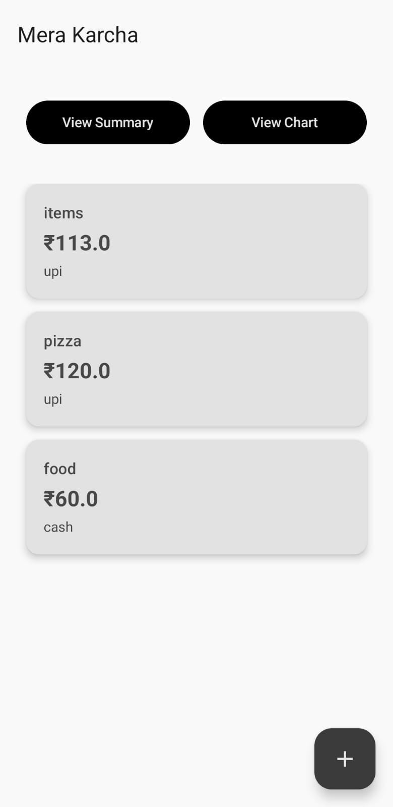
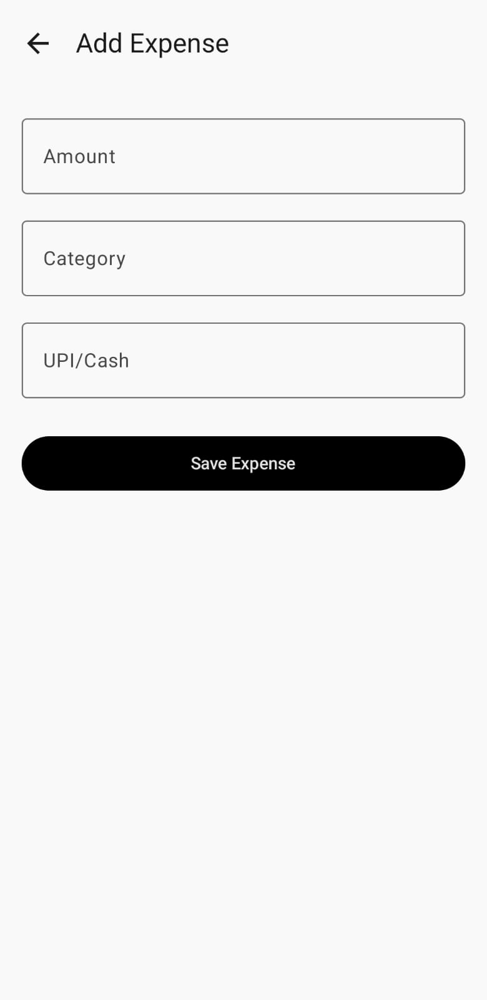
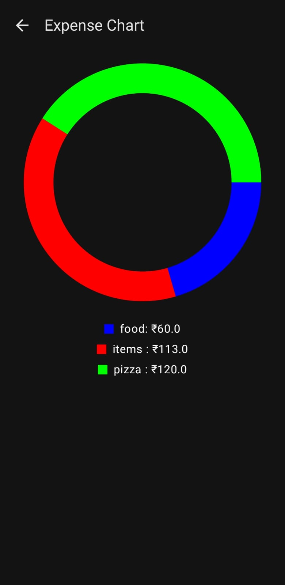

# Expense Tracker App 📱(Mera Karcha)

## Features
- Add and manage expenses
- Category-wise expense summary
- Persistent storage using Room
- Real-time updates with Flow
- Expense visualization with charts

## Tech Stack
- Kotlin
- Jetpack Compose
- MVVM Architecture
- Room Database
- Coroutines & Flow

## Screenshots

  
  
   
  

## How it works
Expenses are stored locally using Room. 
Flow ensures UI updates automatically when data changes.

## Future Improvements
- Cloud sync
- Monthly reports
- Export to CSV
